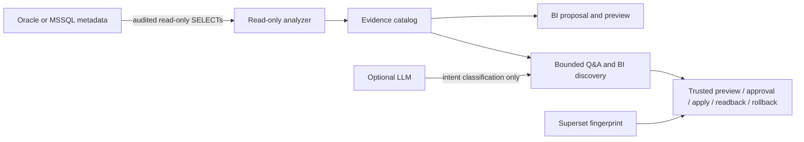

# KaleidoSphere

[](https://github.com/JimPansky/KaleidoSphere/actions/workflows/ci.yml)
[](https://github.com/JimPansky/KaleidoSphere/releases/latest)
[](LICENSE)
[](compose.yaml)

**KaleidoSphere — Multi-perspective Business & Decision Intelligence**

KaleidoSphere is the PANSPHAIRA ecosystem system for Business Intelligence,
analytics, and Decision Intelligence. KaleidoSphere transforms fragmented
enterprise data into coherent perspectives, revealing patterns, dependencies
and actionable insights.

Understand your database. Define the right dashboards. Keep SQL, credentials
and persistent authority out of clients and models.

KaleidoSphere is a local first-pass database understanding and BI
requirements workflow for BI, data, and platform teams. It analyzes Oracle or
Microsoft SQL Server metadata with a read-only account, stores an
evidence-bound technical catalog, guides dashboard requirement discovery, and
prepares review-bound technical overview workflows for its own Apache Superset
stack. Optional model use is limited to bounded intent classification.

## What you can do

- Analyze Oracle or Microsoft SQL Server metadata with audited read-only query packs.
- Build a versioned local catalog with receipt IDs, snapshot hashes, coverage states, and blind spots.
- Ask bounded technical questions about size, statistics, dependencies, stored logic, and coverage.
- Run guided BI requirements discovery and export a human/machine brief with catalog provenance.
- Preview fixed managed Superset overview dashboards for system, table, code, and coverage views.
- Collect a read-only Superset runtime fingerprint before future reviewed promotion planning.
- Build, inspect, and fail-closed preflight a deterministic review-only promotion ZIP from confirmed evidence.
- Execute a human-approved bundle only against an isolated synthetic owned metadata target, with backup, UUID readback, idempotency, and restore proof.

## Try it in 5 minutes

The default quickstart uses a deterministic synthetic fixture. It does not need
an external database or an API key.

Requirements: Docker Engine with Compose v2, OpenSSL, and free localhost ports
`18088` and `18790`.

```bash
git clone https://github.com/JimPansky/KaleidoSphere.git
cd KaleidoSphere
cp .env.example .env
./bin/bi setup
./bin/bi up
./bin/bi analyze
./bin/bi ask "Largest tables by size"
./bin/bi discovery start demo
./bin/bi discovery answer demo audienceRole "Sales analyst"
./bin/bi discovery answer demo businessQuestions '["Which order value should be watched weekly?"]'
./bin/bi discovery status demo
./bin/bi superset-fingerprint collect
./bin/bi down
```

Open <http://127.0.0.1:18790> for KaleidoSphere and
<http://127.0.0.1:18088> for Superset. The generated Superset `analyst`
password is stored in `.runtime/secrets/superset_analyst_password` with mode
`0600` and is not printed by the scripts.

## First result

The fixture run returns real local evidence over synthetic metadata, not
production evidence. A successful response includes:

```json
{
  "intent": "ANALYZE",
  "tools": ["status", "analyze", "catalog_ingest", "readback", "catalog_question"],
  "analysisReceipt": {
    "receiptId": "mssql-...",
    "runtimeValidation": "SYNTHETIC_UNVALIDATED",
    "snapshotSha256": "..."
  },
  "publication": {"status": "AWAITING_TRUSTED_APPROVAL", "mutationPerformed": false}
}
```

Local catalog answers include receipt, snapshot, scope, and coverage caveats.

## Workflow



KaleidoSphere does not send free-form SQL to a source database, does not
sample source rows, and does not give Superset direct source-database
credentials.

## Why teams use it

Direct LLM-to-SQL workflows can blur exploration, credential-bearing access, and
production data exposure. KaleidoSphere narrows the surface: collect safe
metadata, preserve coverage evidence, ask deterministic catalog-bound questions,
turn requirements into a reviewable brief, and show fixed technical dashboards
backed by the local catalog.

## Security by design

- Source adapters use read-only metadata queries and fail closed on unsafe
  rights or scope mismatch.
- Source rows, raw SQL prompts, credentials, raw PL/SQL/view text, DB-link secrets, and provider keys are excluded from model input.
- Superset connects only to the local projection database; it does not receive
  Oracle or MSSQL credentials.
- The default agent path runs offline with `LLM_MODE=stub`.
- Optional OpenAI-compatible providers may classify only `ANALYZE`, `STATUS`, or `DENY`.
- Containers are unprivileged, capability-dropped, and expose only localhost UI ports.
- Destructive reset requires `./bin/bi reset --yes-i-understand`.

See [docs/SECURITY.md](docs/SECURITY.md) for the full trust boundary.

## Live database configuration

The fixture mode in `.env.example` is the portable default. To analyze a live
database, choose exactly one engine:

- `BI_ENGINE=mssql` for Microsoft SQL Server metadata analysis.
- `BI_ENGINE=oracle` for Oracle metadata analysis through `node-oracledb` Thin
  mode.

Put source passwords only in `.secrets/mssql_password` or `.secrets/oracle_password`,
keep the files mode `0600`, and grant the analyzer principal only the minimum
read visibility for the declared schemas. Details are in
[docs/CONFIGURATION.md](docs/CONFIGURATION.md).

## Current capabilities and boundaries

Supported today:

- Oracle and Microsoft SQL Server read-only metadata analysis.
- Bounded PostgreSQL read-only metadata pilot with a frozen catalog pack and
  digest-pinned synthetic PostgreSQL 16.10 E2E/readback evidence.
- Versioned evidence-bound local technical catalog and bounded technical Q&A.
- Guided BI requirements discovery with Markdown/JSON brief export.
- Review-bound managed technical overview dashboard workflows in Apache Superset.
- Server-attested external API `2.0.0` for status, discovery, analyze, plan,
  preview and readback; the runtime reports product `v0.10.0` and exact
  capabilities at `GET /v2/capabilities`.
- Read-only Superset 6.1.0 runtime fingerprint and fail-closed planning preflight.
- Deterministic `chimpmaera.bi/superset-promotion-bundle/v1` review ZIP build,
  inspection, checksum, and fail-closed preflight.

Not claimed today:

- Ambient or client-authorized dynamic dataset, chart, or dashboard mutation.
- Production/customer promotion, Superset-native ZIP import/export, or dynamic
  source-connected asset creation. The execution adapter is synthetic-owned and local-only.
- Free-form SQL, SQL Lab, row sampling, semantic-model generation, or direct production compatibility.
- Direct Superset-to-source Oracle/MSSQL connections.
- SSO, HA, Kubernetes, or managed multi-tenant operation.

## Docs

- [Architecture](docs/ARCHITECTURE.md), [Configuration](docs/CONFIGURATION.md),
  [Security](docs/SECURITY.md), [Roadmap](docs/ROADMAP.md),
  [Release notes](docs/RELEASE_NOTES.md), and
  [Clean-room validation](docs/CLEAN_ROOM.md)
- Evidence: [Oracle runtime](docs/evidence/M1_ORACLE_RUNTIME.md),
  [Oracle technical inventory](docs/evidence/M2_ORACLE_TECHNICAL_INVENTORY.md),
  [local catalog](docs/evidence/M3_LOCAL_TECHNICAL_CATALOG.md),
  [BI discovery](docs/evidence/M4_GUIDED_BI_DISCOVERY.md),
  [Superset fingerprint](docs/evidence/M5_SUPERSET_FINGERPRINT.md), and
  [promotion bundle contract](docs/evidence/M5_PROMOTION_BUNDLE.md)

## Provenance

KaleidoSphere is a standalone public repository with repository-authored
runtime, catalog, discovery, Superset, fingerprint, promotion-bundle, tests, and docs. Some
analyzer foundations were derived from the public ChimpMaera repository and are
tracked in [SOURCE-MAP.md](SOURCE-MAP.md) and [SOURCE-MAP.json](SOURCE-MAP.json).
