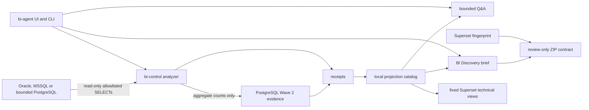

# Architecture

KaleidoSphere is a single-host Docker Compose stack for governed database
metadata understanding and BI requirements discovery. It is intentionally
bounded: source databases are read only, source-row material is excluded from
artifacts, and Superset is used for fixed technical overview dashboards over a
local projection.

## Components

- `bi-agent`: localhost web UI, compatibility chat endpoint and attested v2
  external API. The v2 surface accepts status, analyze, catalog-backed
  Discovery, plan, preview and readback intents only.
- `bi-control`: internal control service. It owns source analyzer execution,
  catalog ingestion, deterministic Q&A, Discovery state, Superset publication,
  readback, fingerprint collection, and the offline promotion-bundle contract.
- `superset`: owned Apache Superset 6.1.0 runtime with local metadata and fixed
  technical dashboards.
- `.runtime/receipts`: local evidence receipts, including analysis receipts and
  the latest Superset fingerprint.
- `.runtime/projection`: local SQLite projection and catalog database used by
  Q&A, Discovery, and Superset dashboards.
- `.runtime/metadata`: local Superset metadata database.
- `.secrets` and `.runtime/secrets`: gitignored file secrets consumed as Docker
  secrets.

## Data flow

1. The source analyzer reads Oracle, MSSQL, or bounded PostgreSQL metadata
   through audited SELECT query packs and a scoped read-only principal.
2. The analyzer writes a local receipt with source scope, coverage states,
   runtime validation status, and snapshot SHA-256.
3. The opt-in PostgreSQL Wave 2 module may additionally execute exact
   allowlisted aggregate count templates for declared columns/candidate pairs.
   It materializes counts and hashes only, then separates observed overlap,
   computed scores, and inferred review proposals in a content-addressed
   Evidence Store and authority-free rule plan.
4. `bi-control` ingests safe receipts into the local technical catalog.
5. Deterministic Q&A and guided BI Discovery read only the local catalog.
6. `bi-control` owns Superset execution, but persistent work is admitted only
   through the exact trusted preview/approval/apply/readback/rollback workflow.
7. External v2 clients receive proposals and semantic readback; they have no
   ambient Superset mutation authority.
8. Independently of the materializer, a confirmed Discovery brief, catalog
   evidence, and fresh compatible fingerprint can produce a deterministic
   review-only ZIP for human review and fail-closed preflight.

## External API v2

`GET /v2/capabilities` is generated by the running SBA process from its own
package version. It binds product `v0.10.0`, external contract `2.0.0`, exact
capability IDs, Adaptive Graph incumbent `adaptive-v1`, and authority boundaries
with canonical SHA-256. `POST /v2/intents` repeats that runtime identity and
digest-binds its result. Clients must validate all of those fields, not trust an
operator-configured version string.

The closed intent set is status, discovery, analyze, plan, preview and readback.
No source/Superset credential, arbitrary URL, free SQL, raw source row or direct
mutation field is part of the contract. PANSPHAIRA is a thin optional client and
does not need a Superset URL or database driver.

## Fixed vs dynamic Superset boundary

Superset execution is managed by the repository. Persistent changes require the
bound trusted preview/direct-UI-approval/apply/readback/rollback workflow. The
public analyze path produces local evidence and never invokes the materializer.
Dashboards are backed by local projection tables, not direct Oracle or MSSQL
connections.

Dynamic datasets, charts, dashboards, imports and exports remain bounded by the
existing trusted workflow and current synthetic/local nonclaims. A deterministic
review ZIP is not a Superset-native import payload and cannot authorize a write.

## Review-only promotion bundle

`chimpmaera.bi/superset-promotion-bundle/v1` binds the confirmed Discovery
brief, catalog receipt/snapshot/scope/coverage, sanitized target identity,
Superset version, fingerprint/OpenAPI/feature-flag freshness, stable UUID review
assets, file hashes, disclosure classification, limitations, and nonclaims.
`promotion-bundle.yaml` and review asset `.yaml` files use the JSON subset of
YAML 1.2, eliminating ambiguous YAML types while remaining valid YAML.

The offline CLI builder, inspector, and preflight code do not call the
materializer, Superset, Oracle, or MSSQL. ZIP parsing is bounded by path,
entry-count, per-entry, total-size, archive-size, compression-ratio, CRC, and
path allowlist checks. Checksums prove integrity only; the contract explicitly
marks review bundles unsigned and makes no authenticity claim.

## Superset fingerprint

The current public release includes a read-only Superset 6.1.0 fingerprint. The
collector records sanitized target identity, Apache Superset runtime version,
OpenAPI canonical SHA-256, security-relevant feature-flag status, provenance,
freshness policy, compatibility verdict, limitations, and nonclaims.

Fingerprint collection uses the internal Superset bridge
`GET /internal/fingerprint` and the existing control token on the internal
network. It does not call the materializer, create assets, import/export ZIPs,
or write Superset metadata.

The planning gate returns
`chimpmaera.bi/superset-planning-gate/v1`. Missing, stale, incompatible,
target-mismatched, OpenAPI-drifted, or unknown-required-flag fingerprints block
future write/import/export/promotion planning and return
`mutation_performed=false`.

## Control and network boundaries

`bi-agent` is exposed only on localhost and can reach `bi-control` through the
internal control network. `bi-control` is the only service with source-egress
network access. Superset is exposed only on localhost and reads the local
projection database; it does not receive source database credentials.

Containers run unprivileged, with `cap_drop: [ALL]`, read-only filesystems where
possible, no Docker socket, bounded pids/memory, and localhost-only published
ports.

## M6-00 assistant contract foundation

M6-00 adds a local, inactive contract layer for a future thin assistant overlay
while preserving native Superset as the visualization UI. Four small
repository-owned modules define event/evidence, static built-in capabilities,
execution/approval, and a deterministic dashboard-state seam. Adapters are
harness-neutral; future Claude Code, Hermes, or OpenClaw integration must enter
through the same contracts and security review.

The overlay boundary accepts typed text/voice stream events and the ten
allowlisted `ui-action/v1` reversible session actions. It has no browser or DOM
driver. Personal saved-view requests remain personal/non-applying; persistent
Superset asset changes remain proposals requiring a preview/diff, trusted UI
approval, BI-Control apply, readback, and rollback that are not implemented in
this slice. See `docs/decisions/M6-00-CONTRACT-SECURITY-FOUNDATION.md`.
