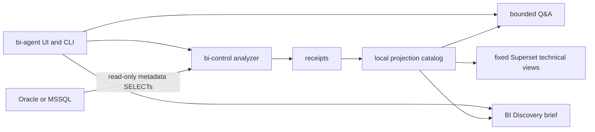

# Architecture

Superset BI Agent is a single-host Docker Compose stack for governed database
metadata understanding and BI requirements discovery. It is intentionally
bounded: source databases are read only, source rows are excluded, and Superset
is used for fixed technical overview dashboards over a local projection.

## Components

- `bi-agent`: localhost web UI and chat endpoint. It accepts status, analyze,
  catalog search, bounded technical Q&A, Discovery commands, and Superset
  fingerprint commands.
- `bi-control`: internal control service. It owns source analyzer execution,
  catalog ingestion, deterministic Q&A, Discovery state, Superset publication,
  readback, and fingerprint collection.
- `superset`: owned Apache Superset 6.1.0 runtime with local metadata and fixed
  technical dashboards.
- `.runtime/receipts`: local evidence receipts, including analysis receipts and
  the latest Superset fingerprint.
- `.runtime/projection`: local SQLite projection and catalog database used by
  Q&A, Discovery, and Superset dashboards.
- `.runtime/metadata`: local Superset metadata database.
- `.secrets` and `.runtime/secrets`: gitignored file secrets consumed as Docker
  secrets.

## Data flow

1. The source analyzer reads Oracle or MSSQL metadata through audited SELECT
   query packs and a scoped read-only principal.
2. The analyzer writes a local receipt with source scope, coverage states,
   runtime validation status, and snapshot SHA-256.
3. `bi-control` ingests the safe receipt into the local technical catalog.
4. Deterministic Q&A and guided BI Discovery read only the local catalog.
5. `bi-control` publishes fixed managed Superset datasets, charts, and
   dashboards over the local projection database.
6. Superset readback verifies the managed assets and returns dashboard URLs.

## Fixed vs dynamic Superset boundary

Current Superset publication is fixed and managed by the repository. The
materializer updates the same predefined technical overview assets
idempotently; repeated analysis does not create duplicates. The dashboards are
backed by local projection tables, not by direct Oracle or MSSQL connections.

Dynamic user-confirmed datasets, charts, dashboards, promotion ZIPs, imports,
and exports are future reviewed capabilities. The current runtime fingerprint
and planning gate prepare for that review path, but they do not authorize or
perform Superset writes beyond the existing fixed managed views.

## Superset fingerprint

The current public release includes a read-only Superset 6.1.0 fingerprint. The
collector records sanitized target identity, Apache Superset runtime version,
OpenAPI canonical SHA-256, security-relevant feature-flag status, provenance,
freshness policy, compatibility verdict, limitations, and nonclaims.

Fingerprint collection uses the internal Superset bridge
`GET /internal/fingerprint` and the existing control token on the internal
network. It does not call the materializer, create assets, import/export ZIPs,
or write Superset metadata.

The planning gate returns
`chimpmaera.bi/superset-planning-gate/v1`. Missing, stale, incompatible,
target-mismatched, OpenAPI-drifted, or unknown-required-flag fingerprints block
future write/import/export/promotion planning and return
`mutation_performed=false`.

## Control and network boundaries

`bi-agent` is exposed only on localhost and can reach `bi-control` through the
internal control network. `bi-control` is the only service with source-egress
network access. Superset is exposed only on localhost and reads the local
projection database; it does not receive source database credentials.

Containers run unprivileged, with `cap_drop: [ALL]`, read-only filesystems where
possible, no Docker socket, bounded pids/memory, and localhost-only published
ports.
